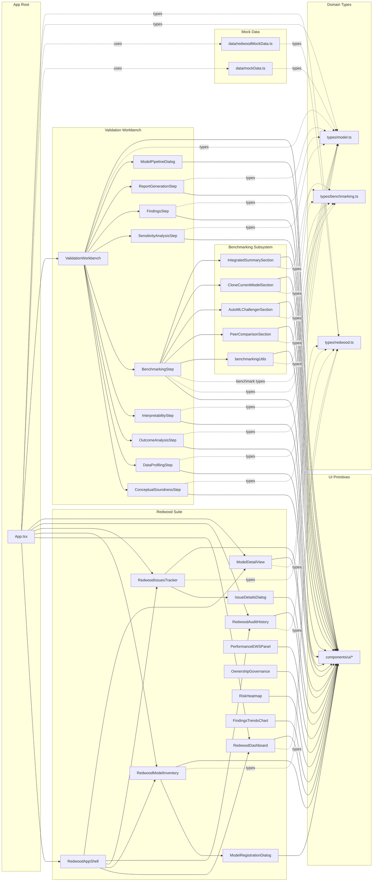

# Model Validation Workbench — Knowledge Graph

This document captures a high-level knowledge graph of the codebase, focusing on:
- Module/component dependencies via internal imports (composition relationships)
- Domain entities (types and mock data)
- Feature groupings (Redwood suite, Validation Workbench, Benchmarking)
- UI primitives cluster

It includes a human-readable mermaid graph and a machine-readable JSON graph for tooling.

---

## Architecture Overview

- Application root
  - App.tsx orchestrates two modes:
    - Redwood suite (governance/inventory/issues/audit)
    - Validation Workbench (end-to-end validation steps)
  - Shares domain entities via types and mock data

- Domain types
  - src/types/model.ts — validation domain (Model, Finding, Validation steps, status enums)
  - src/types/redwood.ts — Redwood domain (RedwoodModel, Issue, AuditEvent, enums)
  - src/types/benchmarking.ts — benchmarking domain (MetricKey, configs, results, helpers)

- Data sources (mock)
  - src/data/mockData.ts — mockModels for Validation Workbench
  - src/data/redwoodMockData.ts — redwoodModels, issues, auditEvents for Redwood features

- Redwood suite (governance and operations)
  - App shell/navigation: RedwoodAppShell
  - Feature views: RedwoodDashboard, RedwoodModelInventory, RedwoodIssuesTracker, RedwoodAuditHistory, ModelDetailView
  - Dialogs: ModelRegistrationDialog, IssueDetailsDialog
  - Analytics/visuals: PerformanceEWSPanel, OwnershipGovernance, RiskHeatmap, FindingsTrendsChart

- Validation Workbench
  - Orchestrator: ValidationWorkbench (tabs + progress + findings log)
  - Steps: ConceptualSoundnessStep, DataProfilingStep, OutcomeAnalysisStep, InterpretabilityStep, BenchmarkingStep, SensitivityAnalysisStep, FindingsStep, ReportGenerationStep
  - Pipeline/History: ModelPipelineDialog

- Benchmarking subsystem
  - Orchestrator: BenchmarkingStep
  - Utilities: benchmarkingUtils (metric helpers, synthetic baselines and results)
  - Sections: PeerComparisonSection, AutoMLChallengerSection, CloneCurrentModelSection, IntegratedSummarySection

- UI primitives
  - src/components/ui/* — Shadcn/Radix based primitives (Button, Card, Tabs, Table, Dialog, etc.)
  - All feature components compose these primitives

---

## Mermaid Knowledge Graph



Notes:
- Edges represent internal import/composition.
- Dashed edges denote "uses types" or "uses mock data".
- UI cluster aggregates all UI primitives in src/components/ui/* to keep the graph readable.

---

## Machine-Readable Knowledge Graph (JSON)

This JSON graph normalizes nodes by file and captures edges by relation.

```json
{
  "nodes": [
    { "id": "app", "label": "App.tsx", "kind": "app", "path": "src/App.tsx" },

    { "id": "redwoodAppShell", "label": "RedwoodAppShell", "kind": "component", "path": "src/components/RedwoodAppShell.tsx" },
    { "id": "redwoodDashboard", "label": "RedwoodDashboard", "kind": "component", "path": "src/components/RedwoodDashboard.tsx" },
    { "id": "redwoodModelInventory", "label": "RedwoodModelInventory", "kind": "component", "path": "src/components/RedwoodModelInventory.tsx" },
    { "id": "redwoodIssuesTracker", "label": "RedwoodIssuesTracker", "kind": "component", "path": "src/components/RedwoodIssuesTracker.tsx" },
    { "id": "redwoodAuditHistory", "label": "RedwoodAuditHistory", "kind": "component", "path": "src/components/RedwoodAuditHistory.tsx" },
    { "id": "modelDetailView", "label": "ModelDetailView", "kind": "component", "path": "src/components/ModelDetailView.tsx" },
    { "id": "modelRegistrationDialog", "label": "ModelRegistrationDialog", "kind": "component", "path": "src/components/ModelRegistrationDialog.tsx" },
    { "id": "issueDetailsDialog", "label": "IssueDetailsDialog", "kind": "component", "path": "src/components/IssueDetailsDialog.tsx" },
    { "id": "performanceEWSPanel", "label": "PerformanceEWSPanel", "kind": "component", "path": "src/components/PerformanceEWSPanel.tsx" },
    { "id": "ownershipGovernance", "label": "OwnershipGovernance", "kind": "component", "path": "src/components/OwnershipGovernance.tsx" },
    { "id": "riskHeatmap", "label": "RiskHeatmap", "kind": "component", "path": "src/components/RiskHeatmap.tsx" },
    { "id": "findingsTrendsChart", "label": "FindingsTrendsChart", "kind": "component", "path": "src/components/FindingsTrendsChart.tsx" },

    { "id": "validationWorkbench", "label": "ValidationWorkbench", "kind": "component", "path": "src/components/ValidationWorkbench.tsx" },
    { "id": "conceptual", "label": "ConceptualSoundnessStep", "kind": "step", "path": "src/components/validation-steps/ConceptualSoundnessStep.tsx" },
    { "id": "dataProfiling", "label": "DataProfilingStep", "kind": "step", "path": "src/components/validation-steps/DataProfilingStep.tsx" },
    { "id": "outcomeAnalysis", "label": "OutcomeAnalysisStep", "kind": "step", "path": "src/components/validation-steps/OutcomeAnalysisStep.tsx" },
    { "id": "interpretability", "label": "InterpretabilityStep", "kind": "step", "path": "src/components/validation-steps/InterpretabilityStep.tsx" },
    { "id": "benchmarking", "label": "BenchmarkingStep", "kind": "step", "path": "src/components/validation-steps/BenchmarkingStep.tsx" },
    { "id": "sensitivity", "label": "SensitivityAnalysisStep", "kind": "step", "path": "src/components/validation-steps/SensitivityAnalysisStep.tsx" },
    { "id": "findings", "label": "FindingsStep", "kind": "step", "path": "src/components/validation-steps/FindingsStep.tsx" },
    { "id": "report", "label": "ReportGenerationStep", "kind": "step", "path": "src/components/validation-steps/ReportGenerationStep.tsx" },
    { "id": "modelPipelineDialog", "label": "ModelPipelineDialog", "kind": "component", "path": "src/components/ModelPipelineDialog.tsx" },

    { "id": "bmUtils", "label": "benchmarkingUtils", "kind": "utility", "path": "src/components/validation-steps/benchmarking/benchmarkingUtils.ts" },
    { "id": "peerSection", "label": "PeerComparisonSection", "kind": "component", "path": "src/components/validation-steps/benchmarking/PeerComparisonSection.tsx" },
    { "id": "automlSection", "label": "AutoMLChallengerSection", "kind": "component", "path": "src/components/validation-steps/benchmarking/AutoMLChallengerSection.tsx" },
    { "id": "cloneSection", "label": "CloneCurrentModelSection", "kind": "component", "path": "src/components/validation-steps/benchmarking/CloneCurrentModelSection.tsx" },
    { "id": "summarySection", "label": "IntegratedSummarySection", "kind": "component", "path": "src/components/validation-steps/benchmarking/IntegratedSummarySection.tsx" },

    { "id": "typesModel", "label": "types/model.ts", "kind": "types", "path": "src/types/model.ts" },
    { "id": "typesRedwood", "label": "types/redwood.ts", "kind": "types", "path": "src/types/redwood.ts" },
    { "id": "typesBenchmarking", "label": "types/benchmarking.ts", "kind": "types", "path": "src/types/benchmarking.ts" },

    { "id": "mockModels", "label": "data/mockData.ts", "kind": "data", "path": "src/data/mockData.ts" },
    { "id": "redwoodMockData", "label": "data/redwoodMockData.ts", "kind": "data", "path": "src/data/redwoodMockData.ts" },

    { "id": "ui", "label": "components/ui/*", "kind": "ui-cluster", "path": "src/components/ui" }
  ],
  "edges": [
    { "source": "app", "target": "redwoodAppShell", "relation": "imports" },
    { "source": "app", "target": "redwoodDashboard", "relation": "imports" },
    { "source": "app", "target": "redwoodModelInventory", "relation": "imports" },
    { "source": "app", "target": "redwoodIssuesTracker", "relation": "imports" },
    { "source": "app", "target": "redwoodAuditHistory", "relation": "imports" },
    { "source": "app", "target": "modelDetailView", "relation": "imports" },
    { "source": "app", "target": "validationWorkbench", "relation": "imports" },
    { "source": "app", "target": "mockModels", "relation": "imports" },
    { "source": "app", "target": "redwoodMockData", "relation": "imports" },
    { "source": "app", "target": "typesModel", "relation": "imports" },
    { "source": "app", "target": "typesRedwood", "relation": "imports" },

    { "source": "redwoodAppShell", "target": "ui", "relation": "imports" },
    { "source": "redwoodAppShell", "target": "redwoodDashboard", "relation": "composes" },
    { "source": "redwoodAppShell", "target": "redwoodModelInventory", "relation": "composes" },
    { "source": "redwoodAppShell", "target": "redwoodIssuesTracker", "relation": "composes" },
    { "source": "redwoodAppShell", "target": "redwoodAuditHistory", "relation": "composes" },
    { "source": "redwoodAppShell", "target": "modelDetailView", "relation": "composes" },

    { "source": "redwoodDashboard", "target": "typesRedwood", "relation": "uses-types" },
    { "source": "redwoodDashboard", "target": "ui", "relation": "imports" },

    { "source": "redwoodModelInventory", "target": "modelRegistrationDialog", "relation": "composes" },
    { "source": "redwoodModelInventory", "target": "typesRedwood", "relation": "uses-types" },
    { "source": "redwoodModelInventory", "target": "ui", "relation": "imports" },

    { "source": "redwoodIssuesTracker", "target": "issueDetailsDialog", "relation": "composes" },
    { "source": "redwoodIssuesTracker", "target": "typesRedwood", "relation": "uses-types" },
    { "source": "redwoodIssuesTracker", "target": "ui", "relation": "imports" },

    { "source": "redwoodAuditHistory", "target": "typesRedwood", "relation": "uses-types" },
    { "source": "redwoodAuditHistory", "target": "ui", "relation": "imports" },

    { "source": "modelDetailView", "target": "typesRedwood", "relation": "uses-types" },
    { "source": "modelDetailView", "target": "ui", "relation": "imports" },

    { "source": "performanceEWSPanel", "target": "typesRedwood", "relation": "uses-types" },
    { "source": "performanceEWSPanel", "target": "ui", "relation": "imports" },

    { "source": "ownershipGovernance", "target": "typesRedwood", "relation": "uses-types" },
    { "source": "ownershipGovernance", "target": "ui", "relation": "imports" },

    { "source": "riskHeatmap", "target": "typesRedwood", "relation": "uses-types" },
    { "source": "riskHeatmap", "target": "ui", "relation": "imports" },

    { "source": "findingsTrendsChart", "target": "typesRedwood", "relation": "uses-types" },
    { "source": "findingsTrendsChart", "target": "ui", "relation": "imports" },

    { "source": "modelRegistrationDialog", "target": "typesRedwood", "relation": "uses-types" },
    { "source": "modelRegistrationDialog", "target": "ui", "relation": "imports" },

    { "source": "issueDetailsDialog", "target": "typesRedwood", "relation": "uses-types" },
    { "source": "issueDetailsDialog", "target": "ui", "relation": "imports" },

    { "source": "validationWorkbench", "target": "conceptual", "relation": "composes" },
    { "source": "validationWorkbench", "target": "dataProfiling", "relation": "composes" },
    { "source": "validationWorkbench", "target": "outcomeAnalysis", "relation": "composes" },
    { "source": "validationWorkbench", "target": "interpretability", "relation": "composes" },
    { "source": "validationWorkbench", "target": "benchmarking", "relation": "composes" },
    { "source": "validationWorkbench", "target": "sensitivity", "relation": "composes" },
    { "source": "validationWorkbench", "target": "findings", "relation": "composes" },
    { "source": "validationWorkbench", "target": "report", "relation": "composes" },
    { "source": "validationWorkbench", "target": "modelPipelineDialog", "relation": "composes" },
    { "source": "validationWorkbench", "target": "typesModel", "relation": "uses-types" },
    { "source": "validationWorkbench", "target": "ui", "relation": "imports" },

    { "source": "conceptual", "target": "typesModel", "relation": "uses-types" },
    { "source": "conceptual", "target": "ui", "relation": "imports" },

    { "source": "dataProfiling", "target": "typesModel", "relation": "uses-types" },
    { "source": "dataProfiling", "target": "ui", "relation": "imports" },

    { "source": "outcomeAnalysis", "target": "typesModel", "relation": "uses-types" },
    { "source": "outcomeAnalysis", "target": "ui", "relation": "imports" },

    { "source": "interpretability", "target": "typesModel", "relation": "uses-types" },
    { "source": "interpretability", "target": "ui", "relation": "imports" },

    { "source": "benchmarking", "target": "typesModel", "relation": "uses-types" },
    { "source": "benchmarking", "target": "typesBenchmarking", "relation": "uses-types" },
    { "source": "benchmarking", "target": "bmUtils", "relation": "imports" },
    { "source": "benchmarking", "target": "peerSection", "relation": "composes" },
    { "source": "benchmarking", "target": "automlSection", "relation": "composes" },
    { "source": "benchmarking", "target": "cloneSection", "relation": "composes" },
    { "source": "benchmarking", "target": "summarySection", "relation": "composes" },
    { "source": "benchmarking", "target": "ui", "relation": "imports" },

    { "source": "peerSection", "target": "bmUtils", "relation": "imports" },
    { "source": "peerSection", "target": "typesBenchmarking", "relation": "uses-types" },
    { "source": "peerSection", "target": "ui", "relation": "imports" },

    { "source": "automlSection", "target": "bmUtils", "relation": "imports" },
    { "source": "automlSection", "target": "typesBenchmarking", "relation": "uses-types" },
    { "source": "automlSection", "target": "ui", "relation": "imports" },

    { "source": "cloneSection", "target": "bmUtils", "relation": "imports" },
    { "source": "cloneSection", "target": "typesBenchmarking", "relation": "uses-types" },
    { "source": "cloneSection", "target": "ui", "relation": "imports" },

    { "source": "summarySection", "target": "bmUtils", "relation": "imports" },
    { "source": "summarySection", "target": "typesBenchmarking", "relation": "uses-types" },
    { "source": "summarySection", "target": "ui", "relation": "imports" },

    { "source": "sensitivity", "target": "typesModel", "relation": "uses-types" },
    { "source": "sensitivity", "target": "ui", "relation": "imports" },

    { "source": "findings", "target": "typesModel", "relation": "uses-types" },
    { "source": "findings", "target": "ui", "relation": "imports" },

    { "source": "report", "target": "typesModel", "relation": "uses-types" },
    { "source": "report", "target": "ui", "relation": "imports" },

    { "source": "modelPipelineDialog", "target": "ui", "relation": "imports" },

    { "source": "mockModels", "target": "typesModel", "relation": "uses-types" },
    { "source": "redwoodMockData", "target": "typesRedwood", "relation": "uses-types" }
  ]
}
```

---

## Notes and Assumptions

- UI primitives are collapsed into a single cluster node (components/ui/*) for readability. Internally they have mutual imports around utils.ts, button.tsx, etc., via Radix/Shadcn patterns.
- Only internal relationships (relative path imports) are represented as edges. External libraries (lucide-react, recharts, radix-ui, etc.) are omitted from the graph to prevent noise.
- Relationships were derived from import/exports and representative source reads (App.tsx, ValidationWorkbench.tsx) and directory context. Where exact import lines were not exhaustively listed in the snippets, edges are inferred from consistent patterns in the codebase structure.

How to use:
- Render Mermaid section in a Markdown viewer to visualize architecture.
- Consume the JSON to generate alternative graphs (Graphviz, D3) or to run dependency checks.
